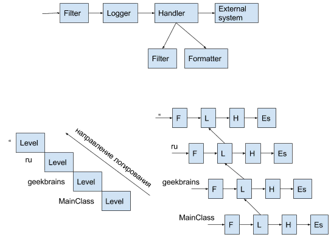
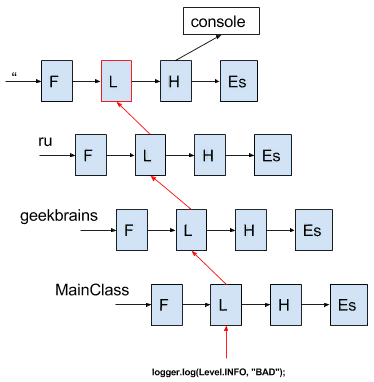

# Логирование на уровне встроенной библиотеки java.util.logging 

Данный фреймворк включен в стандарт и поставляется вместе с JDK, поэтому ничего дополнительно скачивать и подключать вам не надо. JUL имеет следующие уровни логгирования по возрастанию: FINEST, FINER, FINE, CONFIG, INFO, WARNING, SEVERE, а так же ALL и OFF, включающий и отключающий все уровни соответственно.
```java 
Logger log = Logger.getLogger(LoggingJul.class.getName());
```
Методы логгера могут принимать в качестве аргументов строковые сообщения, шаблоны сообщений, исключения, ресурсы локализованных текстовок сообщений, а также, начиная с Java 8, поставщиков строковых сообщений:
```java 
// Строковое сообщение
String stringMessage = "Сообщение";
// Строковое сообщение с параметрами
String stringMessageFormat ="Сообщение {0}";
// Исключение
Throwable throwable = new Throwable();
// ResourceBundle хранящий сообщения
ResourceBundle resourceBundle = ResourceBundle.getBundle("logging.jul.bundle");
// Поставщик сообщений
Supplier<String> stringMessageSupplier = ()->"Сообщение";
```
Выделяется две группы методов: название которых соответствует уровню логгирования и методы log, loggp, logrb, принимающие уровень логгирования в качестве параметра с типом Level. Первая группа содержит методы двух типов: принимающих строковое сообщение или поставщика строковых сообщений:
```java 
log.info(stringMessage);
log.info(stringMessageSupplier);
```
Вторая группа методов имеет следующие вариации:
```java 
// Вывести сообщение с указанием уровня логгирования
log.log(new LogRecord(Level.INFO, stringMessage));
log.log(Level.INFO, stringMessage);
log.log(Level.INFO, stringMessageSupplier);
log.log(Level.INFO, stringMessageFormat, args);
log.log(Level.INFO, stringMessage, throwable );
log.log(Level.INFO, throwable, stringMessageSupplier);
// Вывести сообщение с указанием уровня логгирования, класса и метода
log.logp(Level.INFO, "ClassName", "MethodName", stringMessage);
log.logp(Level.INFO, "ClassName", "MethodName", stringMessageSupplier);
log.logp(Level.INFO, "ClassName", "MethodName", stringMessageFormat, args);
log.logp(Level.INFO, "ClassName", "MethodName", stringMessage, throwable);
log.logp(Level.INFO, "ClassName", "MethodName", throwable, stringMessageSupplier);
// Вывести сообщение с указанием уровня логгирования, класса,
// метода и resourceBundle, хранящего сообщения
log.logrb(Level.INFO, "ClassName", "MethodName", resourceBundle, "messageId");
log.logrb(Level.INFO, "ClassName", "MethodName", resourceBundle, "messageId", throwable);
// Вывести сообщение об ошибке
log.throwing("ClassName","MethodName", throwable);
```
Теперь обратимся к конфигурации фреймворка. По умолчанию JUL будет выводить сообщения на консоль, однако можно задать конфигурацию в файле свойств. Для задания способа вывода сообщений необходимо для вашего логгера указать какие хендлеры он будет использовать. Существует следующие классы хендлеров: FileHandler, ConsoleHandler, StreamHandler, SocketHandler, MemoryHandler. Особенностью JUL является то, что настройки хендлеров задаются в целом для всего класса, а не для конкретного экземпляра, что может порождать не мало проблем, например если вам потребуется сообщения различных логгеров выводить в различные файлы или с различным форматированием. Рассмотрим простой пример конфигурационного файла:
```text  
# Настройки глобального логгера
handlers =java.util.logging. FileHandler
.level=ALL
# Конфигурация файлового хендлера
java.util.logging.FileHandler.level =ALL
java.util.logging.FileHandler.formatter =java.util.logging.SimpleFormatter
java.util.logging.FileHandler.limit = 1000000
java.util.logging.FileHandler.pattern   = log.txt
# Конфигурация консольного хендлера
java.util.logging.ConsoleHandler.level = ALL
java.util.logging.ConsoleHandler.pattern = log.log
java.util.logging.ConsoleHandler.formatter =java.util.logging.SimpleFormatter
```
Для того что бы JUL применил данную конфигурацию нужно передать параметр -Djava.util.logging.config.file = <путь до файла>, либо при старте приложения выполнить код:
```java 
LogManager.getLogManager().readConfiguration(<ваш класс>.class.getResourceAsStream("logging.properties"));
```


### Классная работа

```java 
import java.util.logging.Level;
import java.util.logging.Logger;

/* Будем логировать MainClass */
public class MainClass {
    private static final Logger logger;
    static {
        logger = Logger.getLogger(MainClass.class.getName());
    }
    public static void main(String[] args) {
        /* Вывод сообщение "BAD" в лог */
        logger.log(Level.FINE, "BAD");  
    }
}
```

Уровни логов по степени важности:
* OFF
* SEVERE - самое важное (сюда пишем эксепшены)
* WARNING - предупреждение
* INFO - информация
* CONFIG - настройки
* FINE  - доп. информация
* FINER  - доп. информация
* FINEST  - доп. информация
* ALL - выдать все предупреждения

```java 
/* Будем логировать MainClass */
public class MainClass {
    private static final Logger logger;

    static {
        logger = Logger.getLogger(MainClass.class.getName());
    }

    public static void main(String[] args) {
        /* Мы устанавливаем вывод сообщений выше уровня ALL, но... */
        logger.setLevel(Level.ALL);  
        /* … к сожалению выводит только сообщения выше уровня INFO потому, что выводом занимается 
        только глобальный уровень и чтобы увидеть сообщение надо, см. далее. */
        logger.log(Level.INFO, "BAD");
    }
}
```

Структура логирования



1. Filter - просто отсеивает сообщения
2. Logger - обработка сообщений
3. Handler - фильтрация и форматирование сообщения
4. External system - внешняя система (файл, консоль, сеть, память)

У каждого логгера в иерархии есть свои уровни. 
Есть глобальный уровень логирования, который по умолчанию имеет 3 уровень.

Мы можем получить доступ ко всем уровням:

```java 
/* Будем логировать MainClass */
public class MainClass {
    private static final Logger logger;

    static {
        logger = Logger.getLogger(MainClass.class.getName());
    }

    public static void main(String[] args) {
        logger.setLevel(Level.ALL);
        /* Установим глобальный уровень вывода всех (ALL) сообщений */
        Logger.getLogger("").getHandlers()[0].setLevel(Level.ALL);
        /* Сообщение выводится */
        logger.log(Level.INFO, "BAD");
    }
}
```
```text 
сен 01, 2017 12:56:18 PM ru.davidlevi.conspects.logs.logging.MainClass main
INFO: BAD

Process finished with exit code 0
```

Когда приходит сообщение в логгер, система его транслирует в глобальный уровень



Если мы не хотим, чтобы глобальный хендлер выводил сообщения в консоль, создадим свой хендлер:

```java 
public static void main(String[] args) {
    /* Будем выводить в консоль */
    Handler myHandler = new ConsoleHandler();
    /* Пропускать сообщения уровня ALL */
    myHandler.setLevel(Level.ALL);
    /* Логгер, пропускай все сообщения! */
    logger.setLevel(Level.ALL);
    logger.addHandler(myHandler);
    /*сообщение выводится*/
    logger.log(Level.FINE, "BAD");
}
```
```text 
сен 01, 2017 12:58:34 PM ru.davidlevi.conspects.logs.logging.MainClass main
FINE: BAD

Process finished with exit code 0
```

Если поставить логгеру уровень SEVERE, то мы увидем 2 сообщения:

```java 
public static void main(String[] args) {
    /* Логгер, пропускай все сообщения! */
    logger.setLevel(Level.ALL);
    /* Будем выводить в консоль */
    Handler myHandler = new ConsoleHandler();
    /* Пропускать сообщения уровня ALL */
    myHandler.setLevel(Level.ALL);
    logger.addHandler(myHandler);
    /* Два сообщение выводится в консоль */
    logger.log(Level.SEVERE, "BAD");
}
```
```text 
сен 01, 2017 1:00:14 PM ru.davidlevi.conspects.logs.logging.MainClass main
SEVERE: BAD
сен 01, 2017 1:00:14 PM ru.davidlevi.conspects.logs.logging.MainClass main
SEVERE: BAD

Process finished with exit code 0
```

Это не рационально потому, что будет очень много дублирующихся сообщений.

Если мы скажем логгеру setUseParentHandlers(false), чтобы он не отдавал сообщения родительскому логгеру, то мы не будем видеть сообщения от верхних уровней:

```java 
public static void main(String[] args) {
    logger.setLevel(Level.ALL);
    Handler myHandler = new ConsoleHandler();
    myHandler.setLevel(Level.ALL);
    logger.addHandler(myHandler);
    logger.setUseParentHandlers(false);
    /* Получим одно сообщение без учета родительского хендлера */
    logger.log(Level.SEVERE, "BAD");  
}
```

Теперь настроим форматтер для второго хендлера:

```java 
    public static void main(String[] args) {
        logger.setLevel(Level.ALL);

        Handler myHandler = new ConsoleHandler();
        myHandler.setLevel(Level.ALL);

        Handler myHandler2 = new ConsoleHandler();
        myHandler2.setLevel(Level.ALL);

        /* выводит в формате xml */
        //myHandler2.setFormatter(new XMLFormatter());

        /* Самостоятельное форматирование вывода */
        myHandler2.setFormatter(new Formatter() {
            @Override
            public String format(LogRecord record) {
                return record.getLevel() + record.getMessage() + record.getThreadID();
            }
        });

        logger.addHandler(myHandler);
        logger.addHandler(myHandler2);
        logger.log(Level.SEVERE, "BAD");
    }
```
```text 
сен 01, 2017 1:07:28 PM ru.davidlevi.conspects.logs.logging.MainClass main
SEVERE: BAD
SEVEREBAD1сен 01, 2017 1:07:28 PM ru.davidlevi.conspects.logs.logging.MainClass main
SEVERE: BAD

Process finished with exit code 0
```

Пример установки верхнего уровня логирования:

```java 
public static void main(String[] args) {
    /* Логгер стал логгером уровня ru.davidlevi */
    Logger lg1 = Logger.getLogger("ru.davidlevi");
    
    /* Логгер сам для себя стал родительским логгером */
    Logger lg2 = Logger.getLogger("ru.davidlevi.conspects");       
}
```

Теперь настроим фильтры:

```java 
public static void main(String[] args) {
    Handler myHandler = new ConsoleHandler();

    /* Пропускать если сообщение начинается с Java */
    myHandler.setFilter(new Filter() {
        @Override
        public boolean isLoggable(LogRecord record) {
            return record.getMessage().startsWith("Java");
        }
    });

    /* Установка фильтра для глобального логгера. Отработает если есть сообщения с верхнего уровня */
    Logger.getLogger("").setFilter(new Filter() {
        @Override
        public boolean isLoggable(LogRecord record) {
            return false;
        }
    });

    /* Пропускать если сообщение НЕ начинается со слова Java */
    logger.setFilter(new Filter() {
        @Override
        public boolean isLoggable(LogRecord record) {
            return !record.getMessage().startsWith("Java");
        }
    });

    logger.addHandler(myHandler);
    myHandler.setLevel(Level.ALL);
    logger.setLevel(Level.ALL);
    logger.log(Level.SEVERE, "severe Java3");
}
```
```text 
сен 01, 2017 1:14:18 PM ru.davidlevi.conspects.logs.logging.MainClass main
SEVERE: severe Java3

Process finished with exit code 0
```

В папке C:\Program Files\Java\jre\lib есть файл “logging.properties” 
* handlers= java.util.logging.ConsoleHandler  - по умолчанию хендлер отдает в консоль
* .level= INFO - уровень у нас стоит в INFO
* com.xyz.foo.level = SEVERE - тут для любого нашего, любого своего, пакета мы можем задать уровень по умолчанию, но идея неудачная потому, что привязано к текущему ПК.

Для переноса файла настроек логирования надо:
* Скопировать файл “logging.properties” в проект.
* Дописать в код строки:
```java 
LogManager logManager = LogManager.getLogManager();
logManager.readConfiguration(new FileInputStream("logging.properties"));
```

Итого:

```java 
    public static void main(String[] args) throws IOException {
        Handler myHandler = new ConsoleHandler();

        LogManager logManager = LogManager.getLogManager();
        logManager.readConfiguration(new FileInputStream("logging.properties"));

        myHandler.setFilter(new Filter() {
            @Override
            public boolean isLoggable(LogRecord record) {
                return record.getMessage().startsWith("Java");
            }
        });
    }
```


