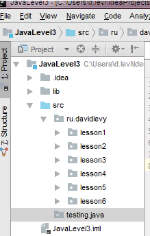
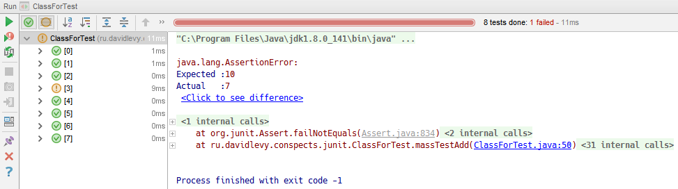

# Тестирование на JUnit
JUnit – это Java фреймворк для тестирования, т. е. тестирования отдельных участков кода, например, методов или классов. Опыт, полученный при работе с JUnit, важен в разработке концепций тестирования программного обеспечения.

JUnit позволяет в любой момент быстро убедиться в работоспособности кода. Если программа не является совсем простой и включает множество классов и методов, то для её проверки может потребоваться значительное время. Естественно, что данный процесс лучше автоматизировать. Использование JUnit позволяет проверить код программы без значительных усилий и не занимает много времени.

Юнит тесты классов и функций являются своего рода документацией к тому, что ожидается в результате их выполнения. И не просто документацией, а документацией которая может автоматически проверять код на соответствие предъявленным функциям. Это удобно, и часто тесты разрабатывают как вместе, так и до реализации классов. Разработка через тестирование — крайне популярная технология создания серьезного программного обеспечения.

Тестирование программного обеспечение можно разделить на два вида:
* тестирование черного ящика;
* тестирование белого ящика.

Во время тестирования программы как черного ящика внутренняя структура приложения в расчет не принимается. Все, что имеет значение, это функциональность, которую приложение должно обеспечить. При тестировании программы как белого ящика во внимание принимается внутренняя структура, т.е. класс и методы. Кроме этого, тестирование можно разделить на четыре уровня:
* юнит тесты — тестирование отдельных участков кода;
* интеграционное тестирование — тестирование взаимодействия и совместной работы компонентов;
* системное тестирование — тестирование всей системы как целого;
* приемное тестирование — итоговое тестирование готовой системы на соответствие требованиям.

Юнит тестирование по определению является тестированием белого ящика.

## JUnit 4 
В JUnit 4 добавлена поддержка новых возможностей из Java 5.0; тесты могут быть объявлены с помощью аннотаций. При этом существует обратная совместимость с предыдущей версией фреймворка. Практически все рассмотренные выше примеры будут работать и в JUnit 4 за исключением RepeatedTest, который отсутствует в новой версии.

```java 
package ru.davidlevy.conspects.junit;

import org.junit.After;
import org.junit.Assert;
import org.junit.Before;
import org.junit.Test;

import java.util.HashMap;
import java.util.Map;

public class MainClass {
}

class JUnit4StringUtilsTest extends Assert {
    private static final Map<String, byte[]> toHexStringData = new HashMap<String, byte[]>();

    @Before
    public static void setUpToHexStringData() {
        toHexStringData.put("", new byte[0]);
        toHexStringData.put("01020d112d7f", new byte[]{1, 2, 13, 17, 45, 127});
        toHexStringData.put("00fff21180", new byte[]{0, -1, -14, 17, -128});
        //...
    }

    @After
    public static void tearDownToHexStringData() {
        toHexStringData.clear();
    }

    @Test
    public void testToHexString() {
        for (Map.Entry<String, byte[]>
                entry : toHexStringData.entrySet()) {
            final byte[] testData = entry.getValue();
            final String expected = entry.getKey();
            final String actual = StringUtils.toHexString(testData);
            assertEquals(expected, actual);
        }
    }
}

abstract class StringUtils {
    private static final int HI_BYTE_MASK = 0xf0;
    private static final int LOW_BYTE_MASK = 0x0f;

    private static final char[] HEX_SYMBOLS = {'0', '1', '2', '3', '4', '5', '6', '7', '8', '9', 'a', 'b', 'c', 'd', 'e', 'f',};

    public static boolean isEmpty(final CharSequence sequence) {
        return sequence == null || sequence.length() <= 0;
    }

    static String toHexString(final byte[] data) {
        final StringBuffer builder = new StringBuffer(2 * data.length);
        for (byte item : data) {
            builder.append(HEX_SYMBOLS[(HI_BYTE_MASK & item) >>> 4]);
            builder.append(HEX_SYMBOLS[(LOW_BYTE_MASK & item)]);
        }
        return builder.toString();
    }
}
```

* Для упрощения работы можно наследоваться от класса Assert, хотя это необязательно.
* Аннотация @Before обозначает методы, которые будут вызваны перед исполнением тестов. Методы должны быть public void. Здесь обычно размещаются предустановки для теста, в нашем случае это генерация тестовых данных (метод setUpToHexStringData).
* Можно использовать аннотацию @BeforeClass, которая обозначает методы, которые будут вызваны до создания экземпляра тест-класса; методы должны быть public static void. Данную аннотацию (метод) имеет смысл использовать для тестирования в случае, когда класс содержит несколько тестов, использующих различные предустановки, либо когда несколько тестов используют одни и те же данные, чтобы не тратить время на их создание для каждого теста.
* Аннотация @After обозначает методы, которые будут вызваны после выполнения тестов. Методы должны быть public void. Здесь размещаются операции освобождения ресурсов после теста; в нашем случае — очистка тестовых данных (метод tearDownToHexStringData).
* Аннотация @AfterClass связана по смыслу с @BeforeClass, но выполняет методы после тестирования класса. Как и в случае с @BeforeClass, методы должны быть public static void.
* Аннотация @Test обозначает тестовые методы. Как и ранее, эти методы должны быть public void. Здесь размещаются сами проверки. Кроме того, в данной аннотации можно использовать два параметра, expected — задает ожидаемое исключение и timeout — задает время, по истечению которого тест считается провалившимся.

Примеры использования аннотаций с параметрами, JUnit Test:

```java 
@Test(expected = NullPointerException.class)
  public void testToHexStringWrong() {
      StringUtils.toHexString(null);
}

@Test(timeout = 1000)
  public void infinity() {
      while (true);
}
```

Игнорирование выполнения теста, JUnit Ignore

Если один из тестов по какой-либо серьезной причине необходимо отключить, например, тест постоянно завершается с ошибкой. Исправление теста можно отложить до светлого будущего аннотированием @Ignore. Если поместить эту аннотацию на класс, то все тесты в этом классе будут отключены.

```java 
@Ignore
@Test(timeout = 1000)
public void infinity() {
      while (true);
}
```

### Правила тестирования, JUnit Rule

JUnit позволяет использовать определенные разработчиком правила до и после выполнения теста, которые расширяют функционал. Например, есть встроенные правила для задания таймаута для теста (Timeout), для задания ожидаемых исключений (ExpectedException), для работы с временными файлами(TemporaryFolder) и др.

Для объявления правила необходимо создать public не static поле типа производного от MethodRule и аннотировать его с помощью ключевого слова Rule.

```java 
public class JUnitOtherTest
{
    @Rule
    public final TemporaryFolder folder = new TemporaryFolder();

    @Rule
    public final Timeout timeout = new Timeout(1000);

    @Rule
    public final ExpectedException thrown = ExpectedException.none();

    @Ignore
    @Test
    public void anotherInfinity() {
        while (true);
    }

    @Test
    public void testFileWriting() throws IOException
    {
        final File log = folder.newFile("debug.log");
        final FileWriter logWriter = new FileWriter(log);
        logWriter.append("Hello, ");
        logWriter.append("World!!!");
        logWriter.flush();
        logWriter.close();
    }

    @Test
    public void testExpectedException() throws IOException
    {
        thrown.expect(NullPointerException.class);
        StringUtils.toHexString(null);
    }
}
```

### Наборы тестов, JUnit Suite, SuiteClasses

Запуск теста может быть сконфигурирован с помощью аннотации @RunWith. Тестовые классы, которые содержат в себе тестовые методы, можно объединить в наборы тестов (Suite). 
Например, создано два класса тестирования объектов: TestFilter, TestConnect. Эти два тестовых класса можно объединить в один тестовый класс TestWidgets.java:

```java 
package com.objects;

import org.junit.runner.RunWith;
import org.junit.runners.Suite;

@RunWith(Suite.class)
@Suite.SuiteClasses ({
    TestFilter.class,
    TestConnect.class
})

public class TestWidgets {}
```

Для настройки запускаемых тестов используется аннотация @SuiteClasses, в которую включены тестовые классы.

### Аннотация Categories

Аннотация Categories позволяет объединить тесты в категории (группы). Для этого в тесте определяется категория @Category, после чего настраиваются запускаемые категории тестов в Suite. Это может выглядеть следующим образом:

```java 
public class JUnitStringUtilsCategoriesTest extends Assert
{
    //...

    @Category (Unit.class)
    @Test
    public void testIsEmpty() {
       //...
    }
    //...
}

@RunWith (Categories.class)
@Categories.IncludeCategory (Unit.class)
@Suite.SuiteClasses ({
    JUnitOtherTest.class, 
	JUnitStringUtilsCategoriesTest.class 
})
public class JUnitTestSuite {}
```

### Аннотация, JUnit Parameterized

Аннотация Parameterized позволяет использовать параметризированные тесты. Для этого в тест-классе объявляется статический метод, возвращающий список данных, которые будут использованы в качестве аргументов конструктора класса.

```java 
@RunWith (Parameterized.class)
public class JUnitStringUtilsParameterizedTest extends Assert
{
    private final CharSequence testData;
    private final boolean expected;

    public JUnitStringUtilsParameterizedTest(final CharSequence testData,
                                             final boolean expected) 
    {
        this.testData = testData;
        this.expected = expected;
    }

    @Test
    public void testIsEmpty () {
        final boolean actual = StringUtils.isEmpty (testData);
        assertEquals(expected, actual);
    }

    @Parameterized.Parameters
    public static List<Object[]> isEmptyData() {
        return Arrays.asList(new Object[][] {
            { null, true },
            { "", true },
            { " ", false },
            { "some string", false },
        });
    }
}
```

### Параметризирование метода : Theories.class, DataPoints, DataPoint, Theory
    
Аннотация Theories параметризирует тестовый метод, а не конструктор. Данные помечаются с помощью @DataPoints и @DataPoint, тестовый метод — с помощью @Theory. Тест, использующий этот функционал, может выглядеть примерно следующим образом: 

```java 
@RunWith (Theories.class)
public class JUnitStringUtilsTheoryTest extends Assert
{
    @DataPoints
    public static Object[][] isEmptyData = new Object[][] {
        { "", true },
        { " ", false },
        { "some string", false },
    };

    @DataPoint
    public static Object[] nullData = new Object[] { null, true };

    @Theory
    public void testEmpty(final Object... testData)
    {
        final boolean actual = 
                      StringUtils.isEmpty ((CharSequence) testData[0]);
        assertEquals(testData[1], actual);
    }
}
```

### Порядок выполнения тестов
    
Если необходимо выполнить тест в определенном порядке, то можно воспользоваться аннотацией @FixMethodOrder(MethodSorters.NAME_ASCENDING), определенной в JUnit 4.11. Например:

```java 
@FixMethodOrder(MethodSorters.NAME_ASCENDING)
public class MyTest {
    @Test 
	public void test01(){...}
    @Test 
	public void test02(){...}
	...
    @Test 
	public void test09(){...}
}
```

В противном случае можно использовать следующие 2 подхода.
```java 
void test01(); 
void test02(); 
...
void test09(); 

@Test
public void testOrder1() { test1(); test3(); }

@Test(expected = Exception.class)
public void testOrder2() { test2(); test3(); test1(); }

@Test(expected = NullPointerException.class)
public void testOrder3() { test3(); test1(); test2(); }
```
```java 
@Test
public void testAllOrders() {
    for (Object[] sample: permute(1, 2, 3)) {
        for (Object index: sample) {
            switch (((Integer) index).intValue()) {
                case 1: test1(); break; 
                case 2: test2(); break; 
                case 3: test3(); break; 
            }
        }
    }
}
```

### Список основных аннотаций:
* метод является тестовым 
```java 
@Test
public void testMethod()	
```
* если время выполнения превысит параметр timeout, то тест будет завершен неудачно 
```java 
@Test(timeout=100)
public void testMethod()	
```
* метод должен выбросить исключение принадлежащие к классу MyException, в противном случае тест будет завершен неудачно 
```java 
@Test (expected = MyException.class)
public void testMethod()	
```
* игнорировать тестовый метод 
```java 
@Ignore
public void testMethod()	
```
* метод вызывающийся один раз для класса перед выполнением тестовых методов; здесь можно разместить инициализацию которую нужно выполнять только один раз, например, прочитать данные, которые будут использоваться в тестовых методах или создать соединение с базой данных 
```java 
@BeforeClass
public static void testMethod()	
```
* метод вызывающийся один раз для класса после выполнения тестовых методов; здесь можно разместить деинициализацию которую нужно выполнять только один раз, например, закрыть соединение с базой данных или удалить данные, которые больше не нужны 
```java 
@AfterClass
public static void testMethod()	
```
* метод, вызывающийся перед каждым тестовым методом в тестовом классе; здесь можно выполнить необходимую инициализацию, например, выставить начальные параметры 
```java 
@Before
public static void beforeMethod()	
```
* метод, вызывающийся после каждого тестового метода в тестовом классе; здесь можно выполнить необходимую деинициализацию, например, удалить данные, которые больше не нужны
```java 
@After
public static void afterMethod()	
```

### Список типов проверок Asserts:
* прерывание теста с ошибкой, т.е. тест будет неудачным
```java 
fail()
fail(String message)
```
* проверка на равенство условия condition значению true
```java 
assertTrue(boolean condition)
assertTrue(java.lang.String message, boolean condition)
```
* проверка на равенство условия condition значению false
```java 
assertFalse(boolean condition)
assertFalse(String message, boolean condition)
```
* проверка на равенство; <тип> — это Object, int, double и т.д.
```java 
assertEquals(<тип> expected, <тип> actual)
assertEquals(String message, <тип> expected, <тип> actual)
```
* проверка массивов на равенство; аналогично assertEquals; <тип> — это Object, int, double и т.д.
```java 
assertArrayEquals(byte[] expecteds, byte[] actuals)
assertArrayEquals(String message, <тип>[] expecteds, <тип>[] actuals)
```
* проверка, что Object не null
```java 
assertNotNull(Object object)
assertNotNull(String message, Object object)
```
* проверка, что Object null
```java 
assertNull(Object object)
assertNull(String message, Object object)
```
* 	проверка на равенство двух объектов expected и actual, т.е. один и тот же объект
```java 
assertSame(Object expected, Object actual)
assertSame(String message, Object expected, Object actual)
```

### Пример JUnit тестирования

Для демонстрации основных возможностей JUnit, используем примитивный java класс FuncMath, который имеет два метода - нахождение факториала неотрицательного числа и суммы двух чисел. Кроме того, в экземпляре класса будет находится счетчик вызовов методов.
```java 
public class FuncMath
{
    int calls;

    public int getCalls() {
        return calls;
    }
    public long factorial(int number) {
        calls++;

        if (number < 0)
            throw new IllegalArgumentException();

        long result = 1;
        if (number > 1) {
            for (int i = 1; i < = number; i++)
                result = result * i;
        }

        return result;
    }

    public long plus(int num1, int num2) {
        calls++;
        return num1 + num2;
    }
}
```
Иногда для выполнения каждого тестового сценария необходим некоторый контекст, например, заранее созданные экземпляры классов. А после выполнения нужно освободить зарезервированные ресурсы. В этом случае используют аннтоации @Before и @After. Метод, помеченный @Before будет выполняться перед каждым тестовым случаем, а метод, помеченный @After - после каждого тестового случая. Если же инициализацию и освобождение ресурсов нужно сделать всего один раз - соответственно до и после всех тестов - то используют пару аннотаций @BeforeClass и @AfterClass.

Тестовый класс с несколькими сценариями будет иметь следующий вид:

```java 
import org.junit.Test;
import org.junit.After;
import org.junit.Before;
import org.junit.Assert;
import org.junit.AfterClass;
import org.junit.BeforeClass;

public class JUnit_funcMath extends Assert
{
    private FuncMath math;

    @Before
    public void init() {
        math = new FuncMath();
    }
    @After
    public void tearDown() { 
        math = null;
    }
    @Test
    public void calls() {
        assertEquals("math.getCalls() != 0", 0, dao.getConnection());

        math.factorial(1);
        assertEquals(1, math.getCalls());

        math.factorial(1);
        assertEquals(2, math.getCalls());
    }

    @Test
    public void factorial() {
        assertTrue(math.factorial(0) == 1);
        assertTrue(math.factorial(1) == 1);
        assertTrue(math.factorial(5) == 120);
    }

    @Test(expected = IllegalArgumentException.class)
    public void factorialNegative() {
        math.factorial(-1);
    }

    @Ignore
    @Test
    public void todo() {
        assertTrue(math.plus(1, 1) == 3);
    }
}
```
Метод calls тестирует правильность счетчика вызовов. Метод factorial проверяет правильность вычисления факториала для некоторых стандартных значений. Метод factorialNegative проверяет, что для отрицательных значений факотриала будет брошен IllegalArgumentException. Метод todo будет проигнорирован.

В заключении следует отметить, что в статье представлены не все возможности использования JUnit. Но как видно из приведенных примеров, фреймворк достаточно прост в использовании, дополнительных возможностей немного, но есть возможность расширения с помощью правил и запускалок.


### Классная работа


Добавим в проект следующие зависимости библиотек:
* junit:junit:4.12 https://mvnrepository.com/artifact/junit/junit/4.12 
* hamcrest-core:1.3 https://mvnrepository.com/artifact/org.hamcrest/hamcrest-core/1.3 

Класс для тестирования:
```java 
public class Calculator {
    public int add(int a, int b) {
        return a + b;
    }

    public int sub(int a, int b) {
        return a - b;
    }

    public int mul(int a, int b) {
        return a * b;
    }

    public int div(int a, int b) {
        return a / b;
    }
}
```

Далее будем писать тесты.
Тесты пишутся отдельно от кода, например в ветке “testing”:



Смысл прямого тестирования заключается в контроле входных и выходных данных по определенным правилам.

Смысл обратного тестирования заключается в… **(Разработка через тестирование (англ. test-driven development, TDD) — техника разработки программного обеспечения, которая основывается на повторении очень коротких циклов разработки: сначала пишется тест, покрывающий желаемое изменение, затем пишется код, который позволит пройти тест, и под конец проводится рефакторинг нового кода к соответствующим стандартам. Кент Бек, считающийся изобретателем этой техники, утверждал в 2003 году, что разработка через тестирование поощряет простой дизайн и внушает уверенность (англ. inspires confidence)[1].)**

Аннотации:
* @Test - выполняет сам тест
* @Test(timeout = 500) - тест по таймауту (false если не уложился во время, мс)
* @Test(expected = ArithmeticException.class) - тест на эксепшен (например, реакция на деление на ноль)
* @Before - выполнить до тестов; динамический блок инициализации; всегда создается новый экземпляр класса
* @BeforeClass - выполнить до тестов; статический блок инициализации
* @After - выполнить после тестов
* @Ignore - игнорирование теста, отключение

```java 
public class CalcTest {
    private Calculator calculator;

    @Before                
    public void startTest() {
        System.out.println("A");
        calculator = new Calculator();
    }

    @After
    public void endTest() {
        System.out.println("B");
    }

    @Test
    public void testAdd() { 
        Assert.assertEquals(4, calculator.add(2, 2)); // Ожидаем, что после add(2, 2) должно получиться 4.
    }

    @Ignore 
    @Test
    public void testSub() {
        Assert.assertEquals(3, calculator.sub(5, 2)); // Ожидаем, что после sub(5, 2) должно получиться 3.
    }

    @Test
    public void testMul() {
        Assert.assertEquals(9, calculator.mul(3, 3)); // Ожидаем, что после sub(5, 2) должно получиться 3.
    }

    @Test(expected = ArithmeticException.class)  
    public void testDiv() {
        Assert.assertEquals(1, calculator.div(2, 0));
    }
}
```

Не рекомендуется делать так, см. ниже, потому что если в тесте будет ошибка, тест дальше не пойдет:
```java 
@Test
public void testAdd() {
    Assert.assertEquals(4, calculator.add(2, 2));
    Assert.assertEquals(6, calculator.add(4, 2)); // допустит здесь ошибка, то дальше не будет проверки.
    Assert.assertEquals(4, calculator.add(2, 2)); // не проверяется
    Assert.assertEquals(4, calculator.add(2, 2)); // не проверяется
    Assert.assertEquals(4, calculator.add(2, 2)); // не проверяется
    Assert.assertEquals(4, calculator.add(2, 2)); // не проверяется
}
```
Примеры ассертов:
```java 
void assertTrue(boolean condition)
void assertFalse(String message, boolean condition)
void assertFalse(boolean condition) 
void assertEquals(Object expected, Object actual) 
void assertEquals(String message, Object expected, Object actual) 
void assertArrayEquals(byte[] expecteds, byte[] actuals)
void fail()    // Вывод сообщения.
```
и др.

Параметрический тест. Порой через один метод требуется прогнать несколько значений, решение:

```java 
package ru.davidlevy.conspects.junit;
import org.junit.Assert;
import org.junit.Before;
import org.junit.Test;
import org.junit.runner.RunWith;
import org.junit.runners.Parameterized;
import java.util.Arrays;
import java.util.Collection;

@RunWith(value = Parameterized.class)
public class ClassForTest {
    @Parameterized.Parameters
    public static Collection<Object[]> data53434() {
        /* имя коллекции вместо data53434 можно указать любое */
        return Arrays.asList(
                new Object[][] {
                        {0,0,0},
                        {1,1,2},
                        {2,2,4},
                        {2,5,10}, // 7
                        {4,2,6},
                        {1,3,4},
                        {6,-2,4},
                        {-1,5,4}
                }
        );
    }

    private int a;
    private int b;
    private int c;

    /* порядковая ассоциация с коллекцией */
    public ClassForTest(int a, int b, int c) {
        this.a = a;
        this.b = b;
        this.c = c;
    }

    private Calculator calculator;

    @Before
    public void init() {
        calculator = new Calculator();
    }

    @Test
    public void massTestAdd() {
        /* Тест в assert будет подставлять значения a,b,c по порядку из коллекции */
        Assert.assertEquals(c, calculator.add(a, b));
    }
}
```




