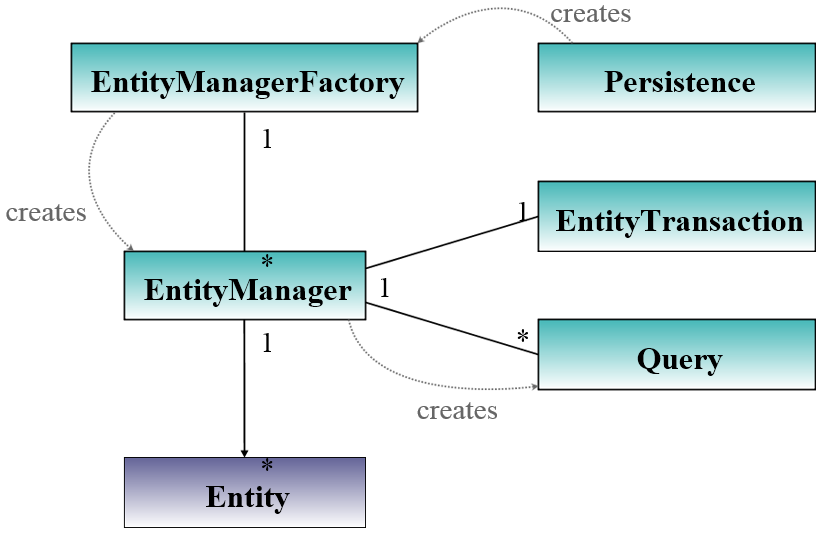
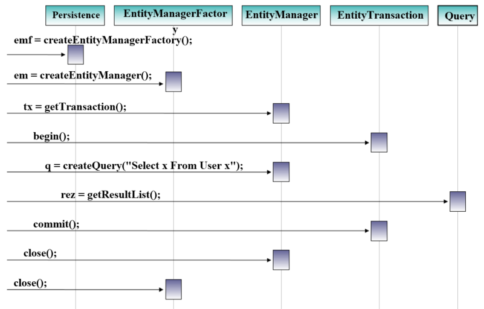
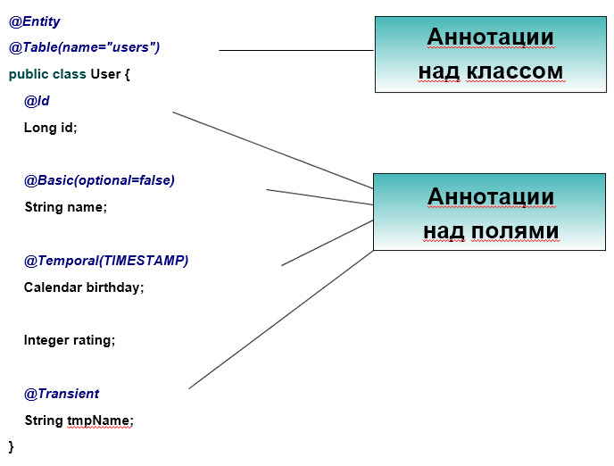

* # Java Persistence API (JPA 2) 
— это спецификация Java EE и Java SE, описывающая систему управления сохранением java объектов в таблицы реляционных баз данных в удобном виде. Сама Java не содержит реализации JPA, однако есть существует много реализаций данной спецификации от разных компаний (открытых и нет). Это не единственный способ сохранения java объектов в базы данных (ORM систем), но один из самых популярных в Java мире.

Рассматриваемые вопросы:
* Что такое JPA?
* Основные интерфейсы
* Базовая конфигурация
* Конфигурация с помощью Hibernate 
* Требования к объектам домена
* Метаданные отображения

***JPA*** – технология, обеспечивающая объектно-реляционное отображение простых JAVA объектов и предоставляющая API для сохранения, получения и управления такими объектами.

***JPA*** – это спецификация (документ, утвержденный как стандарт, описывающий все аспекты технологии), часть EJB3-спецификации

Существуют разные реализации:
* Hibernate
* Oracle TopLink
* Apache OpenJPA

Структура JPA:
* API - Интерфейсы в пакете
* JPQL - Объектный язык запросов
```sql 
SELECT obj FROM User obj
WHERE obj.name = ?1
AND obj.stat.count = ?2
```
* Metadata - Аннотации над объектами
```java 
@Entity
@Table (name="users")
public class User {
@Id
Long id
```

### Основные интерфейсы


### Последовательность взаимодействия интерфейсов


### Базовая конфигурация
/META-INF/persistence.xml
```xml 
<?xml version="1.0" encoding="UTF-8"?>
<persistence version="1.0" xmlns="http://java.sun.com/xml/ns/persistence" 
xmlns:xsi="http://www.w3.org/2001/XMLSchema-instance" 
xsi:schemaLocation="http://java.sun.com/xml/ns/persistence 
http://java.sun.com/xml/ns/persistence/persistence_1_0.xsd">
<persistence-unit name="unit name">
    <provider> full JPA provider class name </provider>
    <class> package.ClassName </class>
    <properties> provider properties </properties>
</persistence-unit>
</persistence>
```

### Базовая конфигурация с Hibernate
* Provider name
```java 
org.hibernate.ejb.HibernatePersistence
```

* Provider properties
```xml 
<property name="hibernate.connection.driver_class" value="org.hsqldb.jdbcDriver"/>
<property name="hibernate.connection.url" value="jdbc:hsqldb:mem:db"/>
<property name="hibernate.connection.username" value="sa"/>
<property name="hibernate.dialect" value="org.hibernate.dialect.HSQLDialect"/>
<property name="hibernate.hbm2ddl.auto" value="create"/>
```

### Требования к объектам домена
* POJO или JavaBean
* Классы не final
* Наличие конструктора по умолчанию
* implements Serializable
* Наличие полей идентификации
* Атрибуты-коллекции обязательно объявлены в терминах интерфейсов коллекций, а не конкретных реализаций
* В Getters необходимо возвращать конкретно ссылку на коллекцию, а не копию её

### Метаданные отображения


### Аннотации над классом
* @Entity
* @Entity (name = "name")  
* @Table (name = "name")
* @Table (name = "name", schema = "name")

Другие аннотации:
* @NamedQueries
* ...

### Аннотации над полями
* @Basic
* @Basic (optional = "true")
* @Column (name = "name")
* @Column (name = "name", unique = "true", nullable = "true")
* @Temporal (TIMESTAMP)
* @Temporal (DATE)
* @Id
* @GeneratedValue
* @Transient
* @Enumerated 
* @Lob

Другие аннотации:
* @OneToMany @ManyToOne
* ...

### Hibernate Validation
* @Length (min=, max=)
* @Min (value=)
* @Max (value=)
* @Range (min=, max=)
* @NotNull
* @NotEmpty
* @Size (min=, max=)
* @Email


#### Ссылки:
* Вопросы и ответы https://habrahabr.ru/post/265061/ 
* Java Persistence API https://easyjava.ru/data/jpa/
* Основы JPA http://alextretyakov.blogspot.ru/2013/06/osnovy-jpa-i-hibernate.html
* Основы Hibernate https://habrahabr.ru/post/29694/
* Руководство по Hibernate. Пример простого приложения http://proselyte.net/tutorials/hibernate-tutorial/simple-application/
* Hibernate — пакет для DAO http://java-course.ru/student/book2/hibernate-first/


