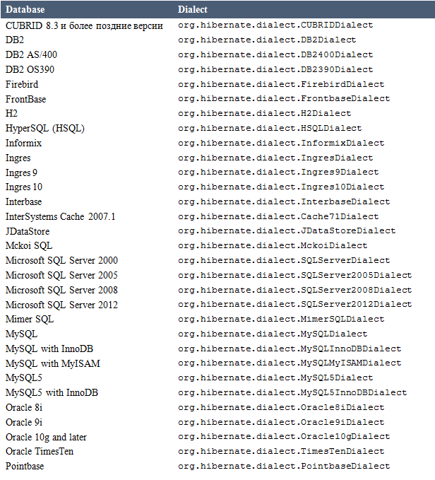
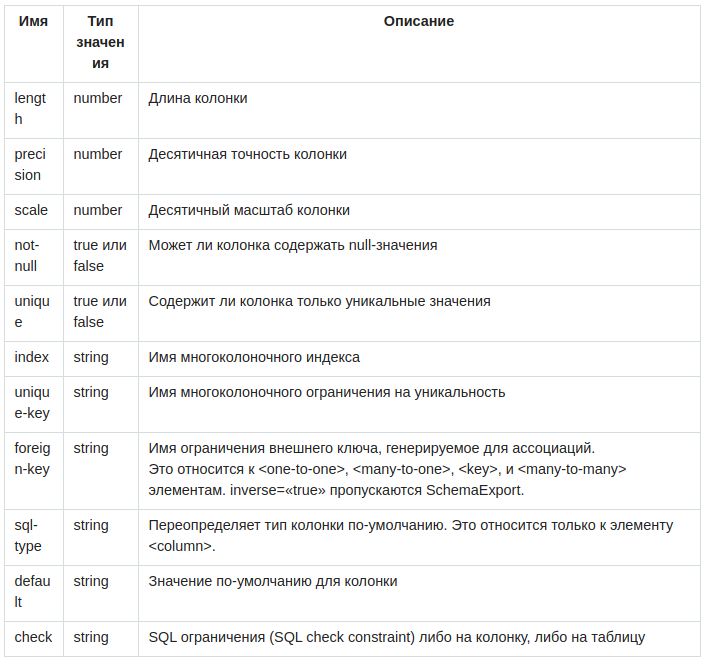

# Hibernate
* Глава I. Доступ к базе данных https://habrahabr.ru/post/301384/
* Глава II. Транзакции и контроль многопоточности https://habrahabr.ru/post/269485/

Пока нет в конспекте:
* Глава III. нет
* Глава IV. Пакетная обработка https://habrahabr.ru/post/269029/
* Глава V. Блокировки https://habrahabr.ru/post/268903/
* Глава VI. Кэширование https://habrahabr.ru/post/268747/

# Глава I. Доступ к базе данных
Перевод первой главы официальной документации Hibernate http://docs.jboss.org/hibernate/orm/4.2/devguide/en-US/html_single/#d5e58 

Перевод статьи актуален для версии Hibernate 4.2.19.Final
# Содержание
***Глава I. Доступ к базе данных*** 
- Предисловие 
- Доступ к базе данных
    - Подключение
        - Конфигурация
        - Получение JDBC-соединения
- Пулинг соединений (Connection pooling)
    - Пулинг с помощью с3p0
    - Пулинг с помощью Proxool
    - Получение соединений от сервера приложений, через JNDI
    - Прочее по конфигурации соединений
    - Необязательные свойства конфигурации
- Диалекты
    - Указание диалекта для использования
    - Разрешение диалекта
- Автоматическая генерация схемы при помощи Schema Export
    - Кастомизация файлов маппинга (Customizing the mapping files)
    - Запуск инструмента SchemaExport
    
***Глава II. Транзакции и контроль многопоточности*** 
- Определение транзакции
- Физические транзакции
    - Физические транзакции — JDBC  
    - Физические транзакции — JTA
    - Физические транзакции — CMT
    - Физические транзакции — Прочее
    - Физические транзакции — Устаревшее
- Применение транзакций Hibernate
- Паттерны и анти-паттерны транзакций
    - Анти-паттерн сессия-на-операцию
    - Паттерн сессия-на-запрос
    - Диалоги (Conversations)
- Идентичность объекта
- Общие вопросы

## Предисловие

Работа как с объектно-ориентированным ПО, так и с реляционными базами данных (далее БД, прим.перев.) может быть весьма обременительной и затратной с точки зрения потраченного времени. Затраты на разработку существенно выше из-за несовпадения парадигм представления данных в объектах и реляционных БД. Hibernate является решением т.н. объектно-реляционного проецирования для Java. Термин объектно-реляционного проецирования отноcится к технике проецирования (маппинга) данных из объектной модели представления к реляционной модели представления (и наоборот). См. en.wikipedia.org/wiki/Object-relational_mapping для более подробного ознакомления.

Хотя для использования Hibernate не обязательно хорошо владеть SQL, понимание основных концепций сыграет неплохую роль в быстром и полном освоении Hibernate. Лучшим подспорьем в освоении является понимание принципов моделирования данных. Информация по нижеследующим ссылкам может оказаться полезной: 
- http://www.agiledata.org/essays/dataModeling101.html
- https://en.wikipedia.org/wiki/Data_modeling

Hibernate не только заботится о проецировании Java-классов в таблицы БД (а также проецировании базовых типов Java к типам SQL), но и предоставляет механизмы формирования запросов и выборок данных. Он может существенно снизить время на разработку, которая в старом стиле велась путем ручной работы с данными с использованием SQL и JDBC. Главная цель архитектурного дизайна Hibernate – избавление разработчика от ежедневных задач работы с данными БД, путем избавления от нужд написания собственной логики работы с данными через SQL и JDBC. Однако, в отличие от других persistence-решений, Hibernate не скрывает от вас возможность использовать всю мощь SQL, и гарантирует, что ваши вложения в реляционные технологии и знания по-прежнему имеют силу.
Hibernate может быть не лучшим решением для приложений, хранящих всю свою бизнес-логику в хранимых процедурах, оно скорее подходит для объектно-ориентированных моделей и логики в среднем (бизнес) слое приложения, написанном на Java. Однако, Hibernate совершенно точно может помочь вам избавиться или инкапсулировать логику специфического SQL-кода, а также справиться с повседневными задачами трансляции результатов ваших запросов из табличного представления в граф объектов.

## Доступ к базе данных

#### Подключение

Hibernate соединяется с базой от имени вашего приложения. Соединение может осуществляться через различного рода механизмы, а именно:
* Встроенный пул соединений. Данный пул соединений не предназначен для работы в “боевом” окружении!
* javax.sql.DataSource
* Пулы соединений, также можно использовать сторонние открытые решения для пулов:
    * c3p0
    * proxool
* Собственноручно созданные приложением JDBC-соединения. Это нерекомендуемый подход и единственная причина его использования – работа с устаревшим (legacy) окружением.

Hibernate получает JDBC-соединения по мере необходимости через интерфейс *org.hibernate.service.jdbc.connections.spi.ConnectionProvider*. Приложения могут также предоставлять свои реализации интерфейса *org.hibernate.service.jdbc.connections.spi.ConnectionProvider* для определения кастомного подхода к предоставлению соединений Hibernate’у. (Из другого пула соединений, например)

#### Конфигурация

Вы можете сконфигурировать соединение к базе данных, используя property-файл, через XML-дескриптор развертывания или программно.

***Пример 1.1. hibernate.properties для пула соединений c3p0***
```properties 
hibernate.connection.driver_class = org.postgresql.Driver
hibernate.connection.url = jdbc:postgresql://localhost/mydatabase
hibernate.connection.username = myuser
hibernate.connection.password = secret
hibernate.c3p0.min_size=5
hibernate.c3p0.max_size=20
hibernate.c3p0.timeout=1800
hibernate.c3p0.max_statements=50
hibernate.dialect = org.hibernate.dialect.PostgreSQL82Dialect
```

***Пример 1.2. hibernate.cfg.xml для соединения к встраиваемой базе данных HSQL***
```xml 
<?xml version='1.0' encoding='utf-8'?>

<hibernate-configuration
        xmlns="http://www.hibernate.org/xsd/hibernate-configuration"
        xsi:schemaLocation="http://www.hibernate.org/xsd/hibernate-configuration hibernate-configuration-4.0.xsd"
        xmlns:xsi="http://www.w3.org/2001/XMLSchema-instance">
  <session-factory>
    <!-- Database connection settings -->
    <property name="connection.driver_class">org.hsqldb.jdbcDriver</property>
    <property name="connection.url">jdbc:hsqldb:hsql://localhost</property>
    <property name="connection.username">sa</property>
    <property name="connection.password"></property>

    <!-- JDBC connection pool (use the built-in) -->
    <property name="connection.pool_size">1</property>

    <!-- SQL dialect -->
    <property name="dialect">org.hibernate.dialect.HSQLDialect</property>

    <!-- Enable Hibernate's automatic session context management -->
    <property name="current_session_context_class">thread</property>

    <!-- Disable the second-level cache  -->
    <property name="cache.provider_class">org.hibernate.cache.internal.NoCacheProvider</property>

    <!-- Echo all executed SQL to stdout -->
    <property name="show_sql">true</property>

    <!-- Drop and re-create the database schema on startup -->
    <property name="hbm2ddl.auto">update</property>
    <mapping resource="org/hibernate/tutorial/domain/Event.hbm.xml"/>
  </session-factory>
</hibernate-configuration>
```

#### Программная конфигурация
     
Экземпляр объекта org.hibernate.cfg.Configuration представляет полный набор типов маппингов на базу данных. Объект org.hibernate.cfg.Configuration создает иммутабельный объект org.hibernate.SessionFactory, и компилирует маппинги из различных XML-файлов. Вы можете указать файлы для маппинга напрямую, или Hibernate может найти их за вас.
     
***Пример 1.3. Указание файлов для маппинга напрямую***
     
Вы можете получить объект org.hibernate.cfg.Configuration, cоздав его и указав XML-документы для маппинга напрямую. Если файлы для маппинга находятся в classpath, используйте метод addResource().
```java 
 Configuration cfg = new Configuration()
     .addResource("Item.hbm.xml")
     .addResource("Bid.hbm.xml");
```   

***Пример 1.4. Hibernate находит файлы за вас***

Метод addClass() указывает Hibernate искать mapping-файлы через classpath, основываясь на имени класса, при этом избавляя вас от необходимости указывать имена файлов самому. В следующем примере, он ищет org/hibernate/auction/Item.hbm.xml и org/hibernate/auction/Bid.hbm.xml.
```java 
Configuration cfg = new Configuration()
    .addClass(org.hibernate.auction.Item.class)
    .addClass(org.hibernate.auction.Bid.class);
```   

***Пример 1.5. Указание свойств конфигурации***
```java 
Configuration cfg = new Configuration()
    .addClass(org.hibernate.auction.Item.class)
    .addClass(org.hibernate.auction.Bid.class)
    .setProperty("hibernate.dialect", "org.hibernate.dialect.MySQLInnoDBDialect")
    .setProperty("hibernate.connection.datasource", "java:comp/env/jdbc/test")
    .setProperty("hibernate.order_updates", "true");
```  

Другие способы программной конфигурации Hibernate
- Передача экземпляра java.util.Properties в Configuration.setProperties().
- Установка системного свойства, используя java -Dproperty=value


#### Получение JDBC-соединения

После того, как вы сконфигурируете Основные jdbc-свойства Hibernate, вы можете использовать метод openSession класса org.hibernate.SessionFactory для открытия сессий. Сессии откроют JDBC-cоединения по требованию, основываясь на предоставленной конфигурации.

***Пример 1.6. Открытие сессии***
```java 
Session session = sessions.openSession();
```  
Основные jdbc-cвойства Hibernate
- hibernate.connection.driver_class
- hibernate.connection.url
- hibernate.connection.username
- hibernate.connection.password
- hibernate.connection.pool_size

#### Пулинг соединений (Connection pooling)

Внутренний алгоритм пулинга соединений в Hibernate довольно рудиментарен, и нужен, по большей части, для разработки и тестирования. Используйте сторонние (3rd party) пулы для лучшей производительности и стабильности. Для использования 3rd party пула, замените значение свойства hibernate.connection.pool_size на соответствующие специфике вашего выбранного пула. Это отключит использование встроенного пула Hibernate.

#### Пулинг с помощью c3p0

C3P0 – опенсорсный пул JDBC-соединений, распространяемый вместе с Hibernate в директории lib/. Hibernate будет использовать свой собственный org.hibernate.service.jdbc.connections.internal.C3P0ConnectionProvider для пулинга соединений, при настройке свойств hibernate.c3p0.*

Важные конфигурационные свойства для c3p0
- hibernate.c3p0.min_size
- hibernate.c3p0.max_size
- hibernate.c3p0.timeout
- hibernate.c3p0.max_statements


#### Пулинг с помощью Proxool

Proxool — другой опенсорсный пул, распространяемый вместе с Hibernate в директории lib/. Hibernate будет использовать свой собственный org.hibernate.service.jdbc.connections.internal.ProxoolConnectionProvider для пулинга соединений при соответствующей настройке hibernate.proxool.*. В отличие от c3p0, proxool требует некоторых дополнительных параметров настройки, которые описаны в документации, доступной на proxool.sourceforge.net/configure.html.

***Таблица 1.1. Важные конфигурационные свойства для пула соединений Proxool***
* ***hibernate.proxool.xml*** :: Сконфигурируйте провайдер Proxool, используя указанный файл XML (.xml добавляется автоматически)
* ***hibernate.proxool.properties*** :: Сконфигурируйте провайдер Proxool, используя указанный property-файл (.properties добавляется автоматически)
* ***hibernate.proxool.existing_pool*** :: Конфигурировать ли провайдер Proxool из существующего пула  
* ***hibernate.proxool.pool_alias*** :: Псевдоним пула Proxool. Необходим.

#### Получение соединений от сервера приложений, через JNDI

Для использования Hibernate внутри сервера приложений, настройте Hibernate для получения соединений от javax.sql.Datasource, зарегистрированном в JNDI, установив по крайней мере одно из следующих свойств:
- hibernate.connection.datasource (необходимо)
- hibernate.jndi.url
- hibernate.jndi.class
- hibernate.connection.username
- hibernate.connection.password

JDBC-соединения, полученные из источника данных JNDI, автоматически участвуют в container-managed транзакциях сервера приложений.

#### Прочее по конфигурации соединений

Вы можете передавать произвольные свойства соединения, добавляя перед ними hibernate.connection. К примеру, для указания свойства charSet используйте имя hibernate.connection.charSet.
Вы можете определить свою стратегию для получения JDBC-соединений, реализовав интерфейс org.hibernate.service.jdbc.connections.spi.ConnectionProvider, и указав вашу пользовательскую реализацию при помощи свойства hibernate.connection.provider_class

#### Необязательные свойства конфигурации

В дополнение к свойствам, перечисленным выше, Hibernate включает в себя множество других параметров. См. более подробный список на http://docs.jboss.org/hibernate/orm/4.2/devguide/en-US/html_single/ 

#### Диалекты

Хотя SQL относительно стандартизирован, каждый поставщик СУБД использует свое подмножество поддерживаемых синтаксисов. У этого есть и другой термин, называемый диалектом. Hibernate поддерживает различные вариации диалектов через класс org.hibernate.dialect.Dialect и различные подклассы для каждого vendor-диалекта.

***Таблица 1.2. Поддерживаемые диалекты СУБД***


#### Указание диалекта для использования

Разработчик может вручную указать диалект для использования, указав в свойстве hibernate.dialect нужное имя подкласса org.hibernate.dialect.Dialect.

#### Разрешение диалекта

Заранее предположив, что org.hibernate.service.jdbc.connections.spi.ConnectionProvider был настроен, Hibernate попытается автоматически определить диалект, основываясь на java.sql.DatabaseMetaData получаемым из объекта java.sql.Connection, который в свою очередь достается из org.hibernate.service.jdbc.connections.spi.ConnectionProvider.
Эта функциональность предоставляется экземплярами org.hibernate.service.jdbc.dialect.spi.DialectResolver, зарегистрированными cамим фреймворком. Hibernate идет вместе со стандартным набором распознаваний. Если в вашем приложении требуются дополнительные возможности распознавания диалекта, вполне возможно зарегистрировать кастомную реализацию org.hibernate.service.jdbc.dialect.spi.DialectResolver, как показано ниже
Зарегистрированные реализации org.hibernate.service.jdbc.dialect.spi.DialectResolver добавляются во внутренний список resolverов, так что они имеют приоритет над уже ранее зарегистрированными resolver’ами, а также над стандартными.


## Автоматическая генерация схемы при помощи SchemaExport
SchemaExport – утилита Hibernate, которая генерит DDL-скрипты из ваших файлов маппинга. Сгенерированная схема включает в себя ограничения ссылочной целостности (referential integrity constraints), основные и внешние ключи для сущностей и таблиц коллекций. Она также создает таблицы для последовательностей(sequences) и спроецированных id-генераторов (identity generators).

***Важно! Вы должны указать диалект SQL через свойство hibernate.dialect, когда используете эту утилиту, так как DDL сам по себе специфичен для каждого вендора. См подробности в секцию “Диалекты” выше.***

Перед тем, как Hibernate сможет сгенерировать вашу схему, вы должны кастомизировать ваши файлы маппинга.

#### Кастомизация файлов маппинга (Customizing the mapping files)
Hibernate предоставляет ряд элементов и атрибутов для ваших файлов маппинга. Они перечислены в Таблице 1.3, “Элементы и аттрибуты, предоставляемые для кастомизации файлов маппинга”, а логический порядок кастомизации представлен в Процедуре 1.1, “Кастомизация схемы”.
     
***Таблица 1.3. Элементы и атрибуты, предоставляемые для кастомизации файлов маппинга***


#### Кастомизация схемы

+ Установка длины, точности, и масштаба элементов маппинга.
Множество элементов маппинга определяют необязательные атрибуты, такие как длина, точность, и масштаб.
```properties 
<property name="zip" length="5"/>
<property name="balance" precision="12" scale="2"/>
```
+ Установка not-null, UNIQUE, unique-key аттрибутов.
not-null и UNIQUE атрибуты генерируют ограничения на табличные колонки.
Атрибут unique-key группирует колонки в единое ограничение по уникальности. Атрибут переопределяет имя любого сгенерированного ограничения уникальности.
```properties 
<many-to-one name="bar" column="barId" not-null="true"/>
<element column="serialNumber" type="long" not-null="true" unique="true"/>

<many-to-one name="org" column="orgId" unique-key="OrgEmployeeId"/>
<property name="employeeId" unique-key="OrgEmployee"/>
```
+ Установка index и foreign-key аттрибутов.
Атрибут index указывает имя индекса для его создания, используя спроецированную колонку или колонки. Вы можете сгруппировать несколько колонок по одному индексу, указав в каждой из них имя одного и того же индекса.
Атрибут внешнего ключа (foreign key) переопределяет имя любого сгенерированного ограничения внешнего ключа.
```properties 
<many-to-one name="bar" column="barId" foreign-key="FKFooBar"/>
```
+ Установка дочерних <column>-элементов.
Множество элементов маппинга допускают использование дочерних <column> элементов. Это бывает полезно для маппинга типов, включающих в себя несколько колонок.
```properties 
<property name="name" type="my.customtypes.Name"/>
	<column name="last" not-null="true" index="bar_idx" length="30"/>
	<column name="first" not-null="true" index="bar_idx" length="20"/>
	<column name="initial"/>
</property>
```
+ Установка атрибута default.
Атрибут default представляет собой значение по-умолчанию для колонки. Добавьте значение к спроецированному свойству перед сохранением нового экземпляра класса.
```properties 
<property name="credits" type="integer" insert="false">
	<column name="credits" default="10"/>
</property>
<version name="version" type="integer" insert="false">
	<column name="version" default="0"/>
</version>
```
+ Установка атрибута sql-type.
Используйте атрибут sql-type для переопределения маппинга по-умолчанию для типов Java на типы SQL.
```properties 
<property name="balance" type="float">
	<column name="balance" sql-type="decimal(13,3)"/>
</property>
```
+ Установка атрибута check.
Используйте атрибут check для указания ограничения check.
```properties 
<property name="foo" type="integer">
	<column name="foo" check="foo > 10"/>
</property>
<class name="Foo" table="foos" check="bar < 100.0">
  ...
  <property name="bar" type="float"/>
</class>
```
+ Добавление "comment" элементов к вашей схеме.
Используйте элемент "comment" для указания комментариев для сгенерированной схемы.
```properties 
<class name="Customer" table="CurCust">
	<comment>Current customers only</comment>
	...
</class>
```

#### Запуск инструмента SchemaExport
Инструмент SchemaExport записывает DDL-скрипт в стандартный поток вывода, исполняет DDL, или и то, и другое сразу.
***Пример 1.7. Синтаксис SchemaExport***
```text 
java -cp hibernate_classpaths org.hibernate.tool.hbm2ddl.SchemaExport options mapping_files 
```   
***Таблица 1.4. Опции SchemaExport*** 

* ***--quiet***	Не выводить скрипт в стандартный поток вывода
* ***--drop***	Только удалять таблицы
* ***--create***	Только создавать таблицы
* ***--text***	Не экспортировать в БД
* ***--output=my_schema.ddl***	Вывести скрипт в указанный файл
* ***--naming=eg.MyNamingStrategy***	выбор NamingStrategy
* ***--namingdelegator=eg.MyNamingStrategyDelegator***	выбор NamingStrategyDelegator
* ***--config=hibernate.cfg.xml***	Чтение конфигурации Hibernate из файла XML
* ***--properties=hibernate.properties***	Чтение свойств БД из указанного файла
* ***--format***	Опрятное форматирование SQL
* ***--delimiter=;***	Разделитель строк

***Важно!*** Опции ***--naming*** и ***--namingdelegator***, не должны использоваться вместе

***Пример 1.8. Встраивание SchemaExport в ваше приложение***
```java 
Configuration cfg = ....;
new SchemaExport(cfg).create(false, true);
```


## Глава II. Транзакции и контроль многопоточности

## Определение транзакции 
Важно понимать, что термин “транзакция” имеет множество смыслов в отношении персистентности и объектно-реляционного проецирования.

В большинстве, но не во всех случаях, подходят следующие определения.
- Может иметь отношение к физическим транзакциям БД.
- Может иметь отношение к логическому понятию “транзакция”, как связанному с контекстом персистентности
- Может отсылать нас к понятию Unit-of-Work, как вполне определенному архитектурному шаблону.

***Важно!*** В данной документации рассматривается логическое и физическое понятия транзакции как одно понятие

## Физические транзакции
   
Hibernate использует JDBC API для персистентности. В мире Java есть два хорошо определенных механизма работы с транзакциями: непосредственно JDBC и JTA. Hibernate поддерживает оба механизма интеграции с транзакциями и позволяет приложениям управлять физическими транзакциями.

Первая концепция в понимании поддержки транзакций в Hibernate – это интерфейс org.hibernate.engine.transaction.spi.TransactionFactory, который предоставляет две основные функции:
- Он позволяет Hibernate понимать семантику транзакций текущего окружения. Работаем ли мы сейчас в окружении JTA? Является ли физическая транзакция в данной момент уже активной, и.т.д
- Он выступает как фабрика экземпляров org.hibernate.Transaction, используемых приложением для управления и проверки состояния транзакций, org.hibernate.Transaction – понятие логической транзакции в Hibernate's. JPA имеет похожее понятие в интерфейсе javax.persistence.EntityTransaction.

***Важно! javax.persistence.EntityTransaction доступен только тогда, когда вы используете resource-local транзакции. Hibernate предоставляет доступ к org.hibernate.Transaction в независимости от окружения.***

org.hibernate.engine.transaction.spi.TransactionFactory – стандартный сервис Hibernate. Cм. Подробности в секции 7.5.16, “org.hibernate.engine.transaction.spi.TransactionFactory” http://docs.jboss.org/hibernate/orm/4.3/devguide/en-US/html_single/#services-TransactionFactory 
#### Физические транзакции — JDBC
Управление транзакциями при помощи JDBC достигается методами java.sql.Connection.commit() и java.sql.Connection.rollback() (JDBC не определяет явного метода для инициирования транзакции). В Hibernate, данный подход представлен классом org.hibernate.engine.transaction.internal.jdbc.JdbcTransactionFactory
#### Физические транзакции — JTA
JTA-подход к транзакциям достигается интерфейсом javax.transaction.UserTransaction, получаемым из API org.hibernate.service.jta.platform.spi.JtaPlatform. Этот подход представлен классом org.hibernate.engine.transaction.internal.jta.JtaTransactionFactory
См. по интеграции с JTA Секция 7.5.9,“org.hibernate.service.jta.platform.spi.JtaPlatform” http://docs.jboss.org/hibernate/orm/4.3/devguide/en-US/html_single/#services-JtaPlatform 
#### Физические транзакции — CMT
Другой JTA-ориентированный подход к транзакциям использует интерфейс javax.transaction.TransactionManager, получаемый из API org.hibernate.service.jta.platform.spi.JtaPlatform. Этот подход представлен классом org.hibernate.engine.transaction.internal.jta.CMTTransactionFactory. В актуальном окружении JEE CM, доступ до javax.transaction.UserTransaction закрыт.

***Важно! Термин CMT потенциально может ввести в заблуждение. Важная часть заключается в том, что физические JTA-транзакции управляются каким-то другим средством, отличным от API Hibernate.***

См. по интеграции с JTA Секция 7.5.9,“org.hibernate.service.jta.platform.spi.JtaPlatform” http://docs.jboss.org/hibernate/orm/4.3/devguide/en-US/html_single/#services-JtaPlatform
#### Физические транзакции — Прочее 
Также возможно подключить пользовательское решение по управлению транзакциями, реализовав контракт org.hibernate.engine.transaction.spi.TransactionFactory. Инициатор службы по-умолчанию имеет встроенную поддержку распознавания пользовательских решений через hibernate.transaction.factory_class, которое может указывать на: 
- Экземпляр org.hibernate.engine.transaction.spi.TransactionFactory.
- Имя класса-реализации org.hibernate.engine.transaction.spi.TransactionFactory. Класс-реализация должен иметь конструктор без аргументов.
#### Физические транзакции — Устаревшее  
Большинство их тех классов, названных выше, были перенесены в новые пакеты во время разработки версии 4.0. Для помощи при переходе на новую версию, Hibernate будет распознавать устаревшие имена на непродолжительный период времени.
- org.hibernate.transaction.JDBCTransactionFactory маппится на org.hibernate.engine.transaction.internal.jdbc.JdbcTransactionFactory
- org.hibernate.transaction.JTATransactionFactory маппится на org.hibernate.engine.transaction.internal.jta.JtaTransactionFactory
- org.hibernate.transaction.CMTTransactionFactory маппится на org.hibernate.engine.transaction.internal.jta.CMTTransactionFactory
## Применение транзакций Hibernate 
Hibernate использует соединения JDBC и ресурсы JTA напрямую, без дополнительной логики синхронизации. Для вас важно ознакомится с JDBC, ANSI SQL, и спецификой изоляции транзакций в вашей СУБД.

Hibernate не проводит синхронизацию на объектах в памяти. Поведение, определенное уровнем изоляции ваших БД-транзакций не меняется, когда вы используете Hibernate. Объект org.hibernate.Session выступает как предоставляющий повторяющиеся чтения (repeatable reads) и запросы кэш, ограниченный пределами транзакции.

***Важно! Для уменьшения конкуренции за блокировки, транзакции должны быть как можно более короткими по времени. Долгие транзакции затрудняют масштабирование вашего приложения до высоких нагрузок. Не надо держать транзакции открытыми во время работы конечного пользователя, их нужно открывать после завершения работы пользователя. Эта концепция также по-другому называется транзакционный write-behind.***
## Паттерны и анти-паттерны транзакций
#### Анти-паттерн сессия-на-операцию 
Это анти-паттерн про открытие и закрытие объекта Session на каждую операцию к БД в одном потоке. Это также анти-паттерн в терминах транзакций БД. Группируйте ваши вызовы в одну запланированную последовательность. Также, не делайте авто-коммит транзакции на каждое SQL-выражение. Hibernate выключает, или ожидает, что сервер приложений немедленно выключит режим авто-коммита. Транзакции к БД никогда не являлись чем-то необязательным. Все коммуникации с БД должны быть обернуты в транзакцию. Избегайте авто-коммита при чтении данных, потому как довольно редко множество небольших транзакций будут работать быстрее, чем одна должным образом определенная транзакция. К тому же, такое множество транзакций трудно поддерживать и расширять.

***Важно! Использование автокоммита не обязательно приводит к использованию БД-транзакций на каждое выражение. Вместо этого, в режиме автокоммита, драйверы JDBC просто проводят каждый вызов в рамках неявного вызова транзакции. Это тоже самое, как если бы ваше приложение проводило вызов commit() транзакции после каждого вызова JDBC.***
#### Паттерн сессия-на-запрос 
Наиболее распространенный паттерн транзакций. Термин “запрос” здесь следует понимать в контексте системы, реагирующей на серии запросов от пользователя/клиента. Веб-приложения является основным примером таких систем, но, конечно, не только они одни. На этапе начала обработки запроса, приложение открывает объект Session, инициирует транзакцию, проводит всю сопутствующую работу с данными, завершает транзакцию и закрывает Session. Суть паттерна – это отношение один-к-одному между транзакцией и сессией. 
В рамках паттерна есть распространенная техника определения текущей сессии для упрощения передачи этой Session между компонентами приложения. Hibernate предоставляет поддержку данной техники через метод getCurrentSession() класса SessionFactory. Концепция «текущей» сессии должна иметь область видимости, которая определяет границы, в которых определение “текущая” верно. Это задача контракта org.hibernate.context.spi.CurrentSessionContext. Есть две надежно определенных области видимости:
- JTA транзакция, которая через callback может дать знать Hibernate, когда она завершилась, что в свою очередь предоставляет возможность завершить текущую сессию. Данная стратегия представлена org.hibernate.context.internal.JTASessionContext – реализацией контракта org.hibernate.context.spi.CurrentSessionContext. С использованием этой реализации, Session будет открыт, как только вызовется getCurrentSession() в пределах транзакции.
- Цикл запроса сам по себе. Лучше всего представлено org.hibernate.context.internal.ManagedSessionContext — реализацией контракта org.hibernate.context.spi.CurrentSessionContext. Здесь есть внешний компонент, ответственный за управлением жизненным циклом и областью видимости “текущей” сессии. На этапе старта области видимости, метод bind() вызывается у ManagedSessionContext с передачей ссылки на сессию. В конце, вызывается метод unbind().

***Важно! Метод getCurrentSession() имеет одну неприятную сторону в JTA. Если вы используете его, after_statement режим освобождения соединений также будет использоваться по умолчанию. Из-за ограничений JTA, Hibernate не может автоматически очищать любой незакрытый экземпляр ScrollableResults или Iterator, возвращаемых scroll() или iterate(). Освобождение курсоров БД осуществляется вызовом ScrollableResults.close() или Hibernate.close(Iterator) явно из секции finally.***
#### Диалоги (Conversations)
Паттерн сессия-на-запрос не является единственным средством дизайна unit of work. Множество бизнес-процессов требуют всей серии взаимодействий с пользователем, которые чередуются с доступом к БД. В веб- и энтерпрайз- приложениях, неприемлемо для транзакции БД охватывать все пользовательское взаимодействие. Рассмотрим следующий пример:

***Процедура 2.1. Пример “долгоиграющего” диалога***
- Открывается первый экран диалога. Данные, показываемые пользователю, подгружаются в отдельной сессии Session и БД-транзакции. Пользователь может модифицировать любые поля диалога.
- После пяти минут редактирования, пользователь использует UI элемент для сохранения. Изменения отразились в БД. Пользователь также ожидает эксклюзивного доступа к данным на время сессии редактирования


Даже, хотя мы и имеем несколько случаев доступа к БД, с точки зрения пользователя, данная серия шагов представляет одну единицу совершенной работы (Unit of Work). Есть множество путей реализации этого в приложении.

Первый (наивный) метод заключается в удержании открытыми сессий Session и транзакции на время редактирования пользователя, с использованием механизмов синхронизации БД для обеспечения эксклюзивного доступа пользователя к редактируемым данным, и предотвращению обращения к ним со стороны других пользователей, гарантируя изоляцию и атомарность. Это анти-паттерн, так как лишняя синхронизация является узким местом при проблемах производительности, встающих в высоконагруженных приложениях.

Ряд транзакций БД используется для реализации диалога с БД. В данном случае, обеспечение изоляции бизнес-процессов ложится на плечи приложения. Один диалог обычно покрывает несколько транзакций. Множественные доступы к БД могут быть атомарными, если только одна транзакция (обычно последняя) осуществляет запись в БД. Все другие только читают данные. Типичный путь реализации – через создание wizard-style диалога, покрывающего несколько шагов цикла запрос/ответ. Hibernate включает в себя некоторые возможности, позволяющие реализовать подобный функционал.

- ***Автоматическое версионирование***

Hibernate может осуществлять за вас concurrency-контроль. Он может автоматически обнаружить, осуществлялись ли сторонние 
обновления данных за время ожидания пользователя.
- ***Отсоединенные (Detached) объекты***

Если вы предпочтете использовать шаблон сессия-на-запрос, 
все загруженные экземпляры будут отсоединены за время ожидания пользователя. Hibernate позволяет вам обратно подсоединить 
объекты и сохранить модификации. Данный паттерн называется сессия-на-запрос-с-отсоединенными объектами. Автоматическое версионирование используется для изоляции параллельно выполняющихся запросов.
- ***Расширенная сессия***

Сессия Session может быть отсоединена от нижележащего JDBC соединения после того, как БД транзакция будет закоммичена, и переподсоединена, когда возникнет новый клиентский запрос. Этот паттерн называется сессия-на-диалог, делающий повторное соединение (reattachment) объектов ненужным. Автоматическое версионирование используется для изоляции параллельных модификаций, при этом сессия не может быть сброшена (flushed) автоматически, только явно.

Сессия-на-запрос-с-отсоединенным-объектами и сессия-на-диалог имеют свои плюсы и минусы.
## Идентичность объекта 
Приложение может осуществлять параллельный доступ к одному и тому же persistent-состоянию (строка в базе данных) в двух разных сессиях. Однако, экземпляр persistent-класса никогда не разделяется между двумя разными сессиями. Имеют место быть и вступают в игру два разных понятия идентичности: БД-идентичность и JVM-идентичность.

***Пример 2.1. БД-идентичность***
```java 
foo.getId().equals( bar.getId() )
```

***Пример 2.2. JVM-идентичность***
```java 
foo==bar
```

Для объектов, присоединенных к одной и той же сессии Session, два понятия идентичности эквивалентны, и JVM-идентичность гарантируется БД-идентичность Hibernate’ом. Приложение может параллельно осуществлять доступ к бизнес-объекту с одной и той же БД-идентичностью в двух разных сессиях, тем временем он будет представлен двумя разными экземплярами Java-объектов, в терминах JVM-идентичности. Разрешение конфликтов осуществляется оптимистичной стратегией и автоматическим версионированием во время сброса(flush)/коммита.

Этот подход возлагает ответственность за управлением параллельностью на Hibernate и БД. Он также обеспечивает лучшую масштабируемость, так как дорогие блокировки не нужны для гарантии идентичности в однопоточном unit of work (single-threaded unit of work). Приложению нет нужды синхронизироваться на каком бы то ни было бизнес-объекте, пока он работает в одном потоке. Хоть это и не рекомендуется, в пределах сессии Session приложение может безопасно использовать оператор == для сравнения объектов.

Однако, приложение, использующее оператор == за пределами сессии Session может внести некоторые проблемы. Если вы добавите два отсоединенных экземпляра объекта в один Set, они возможно будут иметь одну БД-идентичность, т.е они представляют одну и ту же строку в таблице. Совсем не гарантировано, что они будут иметь одну и ту же JVM-идентичность, будучи в состоянии detached. Переопределите методы equals() и hashCode() в persistent-классах, так что они будут иметь собственное определение объектной эквивалентности. Не используйте БД-идентичность для реализации проверки на равенство. Вместо этого, используйте бизнес-ключ, являющийся комбинацией уникальных, неизменяемых атрибутов. БД идентификатор может измениться, если объект перейдет из состояния transient в состояние persistent. Если transient экземпляр находится вместе с detached экземпляром в одном Set’e – изменение хэшкода нарушит контракт Set’а. Атрибуты для бизнес-ключа могут быть менее устойчивыми чем основные ключи. Вам только необходимо гарантировать стабильность до тех пор, пока объекты находятся в одном Set’е. Это не проблема Hibernate, так как относится к реализации объектной идентичности и эквивалентности в Java.
## Общие вопросы

Оба анти-паттерна сессия-на-сессию-пользователя и сессия-на-приложение восприимчивы к следующим проблемам. Часть из этих проблем может возникнуть также и в рекомендованных шаблонах, так что для начала убедитесь, что вы понимаете последствия, перед тем как принимать какие-то решения по дизайну:

* Сессия Session не является потокобезопасной. Сущности, работающие параллельно, такие как HTTP-запросы, session-бины, или Swing worker’ы, приведут к возникновению ситуаций гонки (race conditions) если сессия Session делится между потоками. Если вы храните вашу сессию Hibernate в вашей сессии javax.servlet.http.HttpSession (будет обсуждено позднее), вам нужно рассмотреть проблему синхронизированного доступа к вашей HttpSession; иначе, пользователь, кликающий кнопку ‘Обновить’ слишком быстро, будет использовать одну и ту же сессию в двух параллельно выполняемых потоках.
* Исключение, выбрасываемое Hibernate’ом означает, что вы должны откатить(rollback) вашу транзакцию и закрыть сессию Session немедленно (обсуждается более подробно в следующих главах). Если ваша сессия ограничена приложением, вы должны остановить приложение. Откат транзакции не откатывает ваши бизнес-объекты до состояния, в котором они находились на момент начала транзакции. Это означает, что состояние в БД и состояние объектов подверглось рассинхронизации. Обычно, это не проблема т.к исключения не восстановимы, и вам все равно нужно будет начинать сначала после отката.
* Сессия кэширует каждый объект, находящийся в состоянии persistent (т.е он мониторится и проверяется на изменения Hibernate’ом). Если вы оставите ее на долговременный период, или просто загрузите слишком много данных, она вырастет многократно, до тех пор, пока вы не получите OutOfMemoryException. Есть решение вызывать clear() и evict() для управления кэшем сессии Session, но вам следует рассмотреть альтернативные способы работы с большим количеством данных, такие как хранимые процедуры. Java не является подходящим инструментом для подобного рода операций. Некоторые решения показаны в Главе 4, Пакетная обработка, см. ниже. Сессия, остающаяся открытой на период работы сессии пользователя также означает высокую вероятность появления “несвежих” данных.


